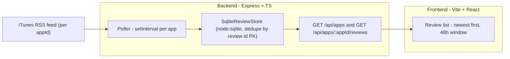

# App Store Reviews Viewer — Take-Home Plan

## Language decision

Go is explicitly ruled out by the assignment for non-Go-familiar candidates. We use **TypeScript end-to-end**: Node + Express on the backend, Vite + React on the frontend. Justification of each dependency goes in the README (Express: routing ergonomics, universally readable; Vitest: bonus testing criterion; everything else is Node stdlib — `fetch` and `node:sqlite` included).

## Storage decision

**SQLite via the stdlib `node:sqlite` module** (zero third-party deps; a SQLite db is still "just a file" per the assignment). Dedupe via `INSERT OR IGNORE` on review id primary key, newest-first via `ORDER BY`, 48h window via `WHERE`, crash safety from SQLite's journal. Caveat: `node:sqlite` is experimental on Node 22 (works, emits a warning; verified locally on v22.22.3) and stable on Node 24 — Docker pins `node:24`, `engines` documents the requirement, and the thin `ReviewStore` interface keeps a swap to better-sqlite3/Postgres trivial.

## Process: issues + commit waves

One GitHub issue per plan step with acceptance criteria; each wave of work is committed referencing its issue (`Closes #N`) so the history demonstrates planned, incremental delivery.

## Architecture

## Repo layout

- `backend/src/rss.ts` — fetch + parse the iTunes JSON feed into a `Review` model (`id, appId, author, title, content, rating, submittedAt`)
- `backend/src/storage/ReviewStore.ts` — small interface; `SqliteReviewStore` implements it with a single SQLite file in `data/` (`reviews` table: `id` PK, indexed `app_id`, `author`, `title`, `content`, `rating`, `submitted_at`). The interface is our "swap in Postgres" answer for scaling.
- `backend/src/poller.ts` — polls each configured app on startup and then every `POLL_INTERVAL` (default 10 min), fetches page 1 (configurable page depth), merges into store
- `backend/src/server.ts` — Express app; `GET /api/apps` lists configured apps, `GET /api/apps/:appId/reviews?hours=48` returns reviews newest-first filtered to the window (hours configurable per the assignment's "increase the window" note)
- `backend/src/config.ts` — `APP_IDS` comma-separated env var (multi-app support), poll interval, data dir
- `frontend/` — Vite + React + TS: app selector (if multiple apps), review cards with content, author, star rating, relative + absolute timestamp; loading/empty/error states; Vite dev proxy to backend so no CORS handling needed
- `docker-compose.yml` — backend service with `./data` volume (persists across restarts), frontend served by nginx proxying `/api` to backend
- `README.md` — run instructions (compose + bare npm), design decisions, multi-app scaling discussion, dependency justifications

## Key behaviors mapped to assessment criteria

- **Stores review data / survives restart**: SQLite file persistence + `INSERT OR IGNORE` dedupe; on restart the poller resumes without duplicating rows. Docker volume proves it under compose.
- **48h window, newest first**: filtering and sorting on the backend endpoint; window configurable.
- **Any number of apps**: app IDs are pure config; storage, polling, and API are all keyed by appId; nothing hardcoded.
- **Bonus tests (Vitest)**: RSS parsing from a fixture of the real feed JSON, store dedupe + persistence round-trip, 48h filter edge cases.

## Time budget (~2.5h)

- Scaffold + backend core (rss, store, poller, API): ~70 min
- Frontend: ~40 min
- Tests: ~25 min
- Docker + compose: ~20 min
- README polish: ~15 min
